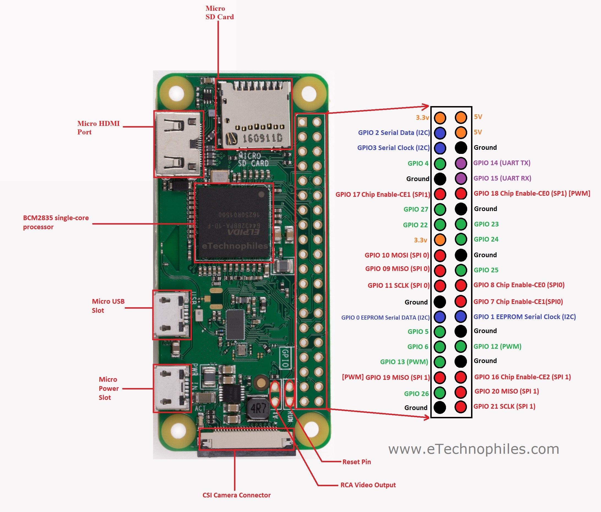

<p align="center">
  <a href="" rel="noopener">
 </a>
</p>

<h3 align="center">Smart In-Car Display</h3>

<div align="center">

[]()


</div>

---


<p align="center"> Smart In-Car Display
    <br> 
</p>

## 📝 Table of Contents

- [About](#about)
- [Getting Started](#getting_started)
- [Prerequisites](#deployment)
- [Installation and Config](#Installation_and_Config)
- [Test](#test)
- [Circuit](#circuit)
- [Smartphone App](#app)
- [Built Using](#built_using)
- [Authors](#authors)

## 🧐 About <a name = "about"></a>

This repo contains circuit, firmware for Smart In-Car Display Project.

## 🏁 Getting Started <a name = "getting_started"></a>

These instructions will get you a copy of the project up and running on your local machine for development and testing purposes. See [deployment](#deployment) for notes on how to deploy the project on a live system.

### Prerequisites <a name = "Prerequisites"></a>

What things you need to install the software and how to install them.

```
- Raspberry Pi Zero W
```

## Installation and Configuration <a name = "Installation_and_Config"></a>

A step by step series that covers how to get the Firmware running.

### Raspberry Pi Firmware Pre-Reqs

1.  Download and install the latest Raspberry Pi OS Desktop image to your SD card
2.  Open the terminal and execute the following command
    ```sudo raspi-config```
3. Then follow the following pictures to enable I2C bus on you raspberry pi

* 
* 
* 
* 
* 

* Then do the same for Serial(UART)

* 

### Auto Installer
* Follow the instructions above before continuing to this section
To install and Run Firmware Automatically just run the following command on your Raspberry Pi terminal

- ```curl -sSL https://raw.githubusercontent.com/Nauman3S/Smart-In-Car-Display/main/Firmware/installer.sh | bash```
### Configuring Raspberry Pi and Running the UI (Manual)
To install and Run Firmware Manually run the following commands on your Raspberry Pi terminal

  1.  Copy Firmware folder to the desktop of your Raspberry Pi, open the terminal of your Raspberry Pi and execute the following commands

  - ```sudo apt-get update```
  - ```sudo apt-get upgrade```
  - ```sudo apt install python3-pip```
  - ```sudo pip3 install pillow```
  - ```sudo apt-get install python3-pil python3-pil.imagetk```
  - ```sudo pip3 install python3-dev```
  - ```sudo python3 -m pip install --upgrade pip setuptools wheel```
  - ```sudo pip3 install hyperpixel2r```
  - ```sudo pip3 install Adafruit_DHT```
  - ```git clone https://github.com/pimoroni/hyperpixel2r```
  - ```cd hyperpixel2r```
  - ```sudo ./install.sh```
  - ```cd ~/Desktop/Firmware```
  - ```sudo chmod a+rx starter.sh```


1.  To run the program just double click on starter.sh file
  1.  or execute `python3 /home/pi/Desktop/Firmware/Firmware.py`


### Removing Un-necessary Packages

Open the terminal and execute the following commands
- sudo apt-get remove --purge libreoffice*
- sudo apt-get remove --purge scratch
- sudo apt-get remove --purge scratch2
- sudo apt-get remove wolfram-engine
- sudo apt-get remove geany
- sudo apt-get clean
- sudo apt-get autoremove
- sudo nano /boot/config.txt
At the bottom of the file add these lines
* disable_splash=1
* dtoverlay=disable-bt
* boot_delay=0

Press CTRL+O and CTRL+X to save the settings and exit.

## ⛏️ Testing <a name = "test"></a>

1.  The Firmware can be tested on Raspberry Pi 3B, 3B+ or 4B with the following modifications
  1.  Connect the sensor as shown in the Circuit Diagram section below.

## 🔌 Circuit Diagram <a name = "circuit"></a>


* RPi 3,4 GPIOs Pinout



### Circuit

```http
Pins connections
```

| DHT22 Inside | Raspberry Pi |
| :--- | :--- |
| `DOUT` | `GPIO16` | 
| `VCC` | `5V` | 
| `GND` | `GND` |  

| DHT22 Outside | Raspberry Pi |
| :--- | :--- |
| `DOUT` | `GPIO18` | 
| `VCC` | `5V` | 
| `GND` | `GND` |  

| MPU6050 | Raspberry Pi |
| :--- | :--- |
| `SCL` | `GPIO5(SCL)` | 
| `SDA` | `GPIO3(SDA)` | 
| `VCC` | `3.3V` | 
| `GND` | `GND` |  


## Components Used

1.  [Raspberry Pi Zero W](https://www.amazon.com/CanaKit-Raspberry-Wireless-Complete-Starter/dp/B072N3X39J/ref=sr_1_1?dchild=1&keywords=raspberry+pi+zero+w&qid=1634732210&sr=8-1) 
2.  [Hyperpixel Display](https://shop.pimoroni.com/products/hyperpixel-round?bis_id=nnNnAAv&utm_campaign=stock-notification&utm_content=HyperPixel%202.1%20Round%20-%20Hi-Res%20Display%20for%20Raspberry%20Pi&utm_medium=email&utm_source=back-in-stock&variant=39381081882707)
3.  [DHT22 Modules](https://www.amazon.com/HiLetgo-Temperature-Humidity-Electronic-Practice/dp/B0795F19W6/ref=sr_1_1?dchild=1&keywords=dht22&qid=1634732274&s=amazon-devices&sr=1-1)
4.  [MPU6050](https://www.amazon.com/Gy-521-MPU-6050-MPU6050-Sensors-Accelerometer/dp/B008BOPN40/ref=sr_1_3?dchild=1&keywords=mpu6050&qid=1634732320&sr=8-3)
5. Any Arduino
6. USG OTG Cable


## ⛏️ Built Using <a name = "built_using"></a>

- [Python3](https://www.python.org/) - Raspberry Pi FW

## ✍️ Authors <a name = "authors"></a>

- [@Nauman3S](https://github.com/Nauman3S) - Development and Deployment
